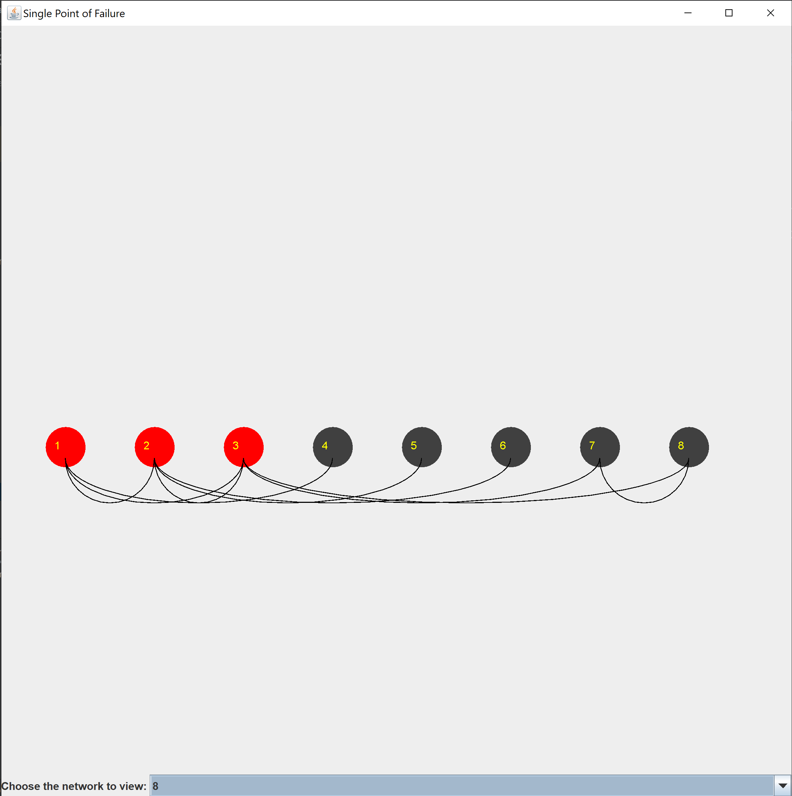

 #PointOfFailure
 
 A single point of failure in a network is a part of a system. 
 If it fails, it will break the entire flow of that system.
 
 This program takes in a file of node pairs which symbolises a 
 network. By depicting the network as a graph, the program identifies
 which node in the network is the point of failure.
 
 _Program Input:_
 
 The program takes multiple strings of integers representing nodes
 in the network. Each node is separated by a space and each network 
 ends with a 0.
 
 A sample network:
 
`1 2`
 
`5 4`
 
`3 1`  

`3 2`

`3 4`

`3 5`

`0`

The input text can be viewed in the problemh.in.txt file.

####Contributers:

Shira Alter

Mindy Gottlieb Spilman

Jennifer Komendant

